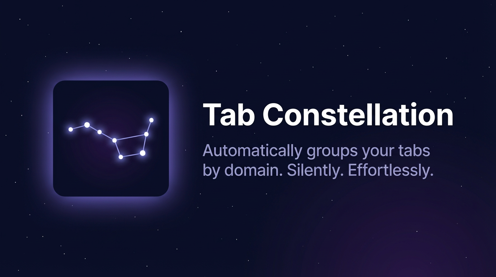

# Tab Constellation



An opinionated Chrome extension designed to group tabs by domain.

No UI, no configuration — it runs silently in the background and keeps your tab strip organized. 

**Rule:** If 2 or more tabs in a window share the same domain, they belong in one tab group. If only 1 tab remains for a domain, it gets ungrouped automatically.

## Features

- Groups HTTPS tabs by eTLD+1 domain (e.g. `app.github.com` and `gist.github.com` both map to `github.com`)
- Strips `www.` prefixes before grouping
- Never touches pinned tabs
- Never changes the active tab or reorders tabs
- Per-window grouping only — no cross-window tab movement
- Per-window debounce (200ms) so rapid navigation and redirects don't cause repeated regrouping
- Groups are labeled with a human-readable domain title (e.g. `GitHub`, `YouTube`)

## Local setup

### Prerequisites

- [Node.js](https://nodejs.org) (for pnpm)
- [pnpm](https://pnpm.io) — install with `npm install -g pnpm`
- Latest [Google Chrome](https://www.google.com/chrome/)

### Install and build

```bash
# Clone the repo
git clone https://github.com/your-username/tab-constellation.git
cd tab-constellation

# Install dev dependencies
pnpm install

# Compile TypeScript to dist/
pnpm build
```

The compiled output lands in `dist/background.js`, which is what Chrome loads as the service worker.

### Load the extension in Chrome

1. Open Chrome and navigate to `chrome://extensions`
2. Enable **Developer mode** (toggle in the top-right corner)
3. Click **Load unpacked**
4. Select the project root directory (the folder containing `manifest.json`)

The extension loads immediately and runs an initial grouping pass over all open windows.

### Development workflow

Use watch mode to recompile on every save:

```bash
pnpm watch
```

After any source change, go to `chrome://extensions` and click the **reload** button on the Tab Constellation card to pick up the new `dist/background.js`.

## Project structure

```
tab-constellation/
├── manifest.json       # Chrome Manifest V3 config
├── package.json
├── tsconfig.json
├── .prettierrc
├── icons/              # Packaged with the extension (referenced by manifest.json)
│   ├── icon-16.png
│   ├── icon-32.png
│   ├── icon-48.png
│   └── icon-128.png
├── assets/             # Repo and store artwork — not packaged into the extension
│   └── banner.png
├── src/
│   ├── background.ts   # Event wiring (onInstalled, onStartup, onUpdated, onRemoved)
│   ├── domain.ts       # getDomainKey() and humanReadableTitleFromDomain()
│   ├── grouping.ts     # applyGroupingForWindow() — core grouping algorithm
│   └── debounce.ts     # Per-window debounce scheduler
└── dist/               # tsc output — gitignored
    └── background.js
```

## Behavior reference

| Scenario | Result |
|---|---|
| 2+ HTTPS tabs share a domain | Grouped with a grey label |
| 1 HTTPS tab remains for a domain | Ungrouped |
| Tab navigates to a new URL | Window regrouped (debounced 200ms) |
| Tab is closed | Window regrouped (debounced 200ms) |
| Tab is pinned | Ignored entirely |
| Tab is not HTTPS | Ignored entirely |
| Browser starts up / extension installs | Full grouping pass over all windows |
